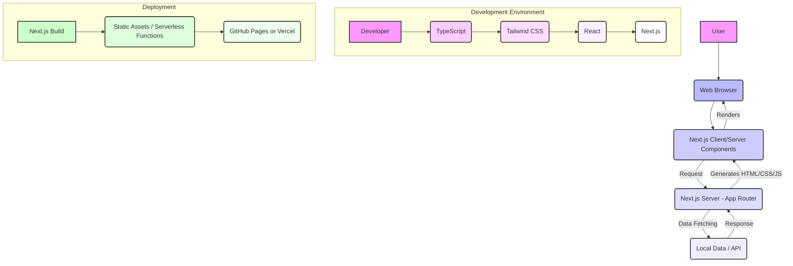

# System Overview

## 1. Project Goal
This project aims to build a personal portfolio website, `github.io`. It effectively showcases the developer's tech stack, project experience, and resume through a user-friendly interface and efficient content management.

## 2. Core Technology Stack
The project is built upon the following core technology stack:

*   **Framework**: **Next.js (App Router)**
    *   A React-based full-stack web framework that utilizes server components, file-system based routing, and optimized data fetching. It is optimized for modern web application development using the App Router.
*   **Language**: **TypeScript**
    *   Adds static typing to JavaScript, enhancing code stability and readability. It helps prevent potential errors during development and is suitable for large-scale application development.
*   **Styling**: **Tailwind CSS**
    *   A utility-first CSS framework that allows for rapid styling directly in HTML using class names. It facilitates responsive design and customization, contributing to the establishment of a consistent design system.

## 3. Architecture Diagram

### 3.1. Description
*   **Client-Server Rendering**: Next.js's App Router uses a hybrid approach of server and client components to provide optimal performance and development experience. Initial loads are handled by the server, while subsequent interactions are processed by the client.
*   **Data Flow**: Data required for web pages is fetched from the local `data` directory or potentially from external APIs.
*   **Deployment**: The built Next.js application can be deployed as static files and serverless functions, hosted on platforms like GitHub Pages or Vercel.

<h2>4. Modules and Components Overview</h2>
<ul>
<li><strong>UI Components</strong>: Reusable UI components are defined in the <code>src/components</code> directory. Consistent styling is maintained using Tailwind CSS.</li>
<li><strong>Pages</strong>: App Router-based pages are located in the <code>src/app</code> directory. Each page maps to a specific route (e.g., <code>/</code>, <code>/about</code>, <code>/resume</code>).</li>
<li><strong>Data</strong>: The <code>src/data</code> directory contains static data used in the project (e.g., skill lists, social media links, timeline data).</li>
</ul>
<h2>5. Agent-Based Development Workflow</h2>

This project utilizes the 5-Agent Specialized Fleet system as defined in <code>GEMINI.md</code>.

<ul>
<li><strong>@manager</strong>: Overall project management and workflow orchestration.</li>
<li><strong>@architect</strong>: System design and technical specification definition (current document author).</li>
<li><strong>@frontend</strong>: UI/UX and client-side logic implementation.</li>
<li><strong>@backend</strong>: API design and server-side business logic implementation (if required).</li>
<li><strong>@tester</strong>: Testing and quality assurance.</li>
</ul>

Each agent documents its work in the <code>.gemini/docs/</code> directory and shares progress via <code>PROGRESS.md</code>.

